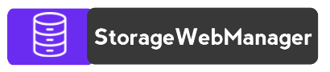

# StorageWebManager <a href="https://www.npmjs.com/package/storagewebmanager"> </a>


<br/>

> Maintain cookies, sessionStorage like never before.

Manager Cookies, sessionStorage without any big messy codes.


[](https://www.npmjs.com/package/storagewebmanager)

<br/>

StorageWebManager can be used for :

- [Cookies](https://en.wikipedia.org/wiki/HTTP_cookie) - Manager Cookies.
- [SessionStorage](https://en.wikipedia.org/wiki/Web_storage) - Manager SessionStorage.
- [Authenticate User](https://en.wikipedia.org/wiki/Authentication) - Valid user.


## Usage


### npm install

```
 npm i storagewebmanager
```

## Manager Cookies

### &#8226; import Component 
```
 import { createCookie, deleteCookie, createVaildityCookie, updateCookie, accessCookie, clearCookies} from 'storagewebmanager';
```
> Import only that Component which you are going to use.

<br/>

### &#8226; create a cookie
```
 createCookie("CookieName", "CookieValue");
```

<br/>

### &#8226; Access a cookie
```
 accessCookie("CookieName"); //return null if cookie not found
```

<br/>


### &#8226; Delete a cookie
```
 deleteCookie("CookieName"); //return null if cookie not found
```

<br/>

### &#8226; create a cookie for particular days
```
 createVaildityCookie("CookieName", "CookieValue", 5); //5 is number of you want to keep cookies in the Storage
```

<br/>

### &#8226; Update a cookie
```
 updateCookie("CookieName", "CookieValue", 5); //5 is number of you want to extend cookies expiry in the Storage
```

<br/>

### &#8226; Clear cookie storage
```
 clearCookies();
```
<br/>

### &#8226; If saving Array in cookies
```
 var data = { name: "Rizwan Sayyed", age: 22, location: "India" }
 createCookie("CookieName", JSON.stringify(data));

```
> SWM have inbuild array dection, If it throw error and did not save json format add JSON.stringify(); to get the output


<br/>
<br/>

## Manager LocalStorage

### &#8226; import Component 
```
 import { addLocalStorage, localStorage} from 'storagewebmanager';
```
> Import only that Component which you are going to use.

<br/>

### &#8226; Add a LocalStorage
```
 addLocalStorage("storageName", "storageValue");
```

<br/>

### &#8226; Remove, Removeall, Get a LocalStorage
```
 localStorage("storageName", "get");
```
> For Remove add "remove" in place of get, "removeall" for delete all data from LocalStorage, "get" to return storagevalue.

<br/>
<br/>

## Manager SessionStorage

### &#8226; import Component 
```
 import { addsessionStorage, sessionStorage} from 'storagewebmanager';
```
> Import only that Component which you are going to use.
> Return 0 if SessionStorage is not supported by browser

<br/>

### &#8226; Add a SessionStorage
```
 addsessionStorage("storageName", "storageValue");
```

<br/>

### &#8226; Remove, Removeall, Get a sessionStorage
```
 sessionStorage("storageName", "get");
```
> For Remove add "remove" in place of get, "removeall" for delete all data from SessionStorage, "get" to return storagevalue.

<br/>

<br/>


## Authenticate User

### &#8226; import Component 
```
 import { userAuth, userAuthSet} from 'storagewebmanager';
```
> Import only that Component which you are going to use.

<br/>

-  <a>userAuthSet("uidValue", "add"); </a>//Add user unique value to help you in future (you can use "add", "remove", "get")

-  <a>userAuth();</a>  //return true if you have uid set (Developer can authenticate using it).

<br/>
<br/>


## NPM
- [NPM](https://www.npmjs.com/package/storagewebmanager) - View storagewebmanager on npmjs.

<br/>
<br/>


## Contribute

Contributions are always welcome! 😊

Contact me on my email <a> sayyedrizwanahmed@gmail.com</a> for any query.

<br/>

MIT License

Copyright (c) Rizwan Sayyed. and its affiliates.

Permission is hereby granted, free of charge, to any person obtaining a copy
of this software and associated documentation files (the "Software"), to deal
in the Software without restriction, including without limitation the rights
to use, copy, modify, merge, publish, distribute, sublicense, and/or sell
copies of the Software, and to permit persons to whom the Software is
furnished to do so, subject to the following conditions:

The above copyright notice and this permission notice shall be included in all
copies or substantial portions of the Software.

THE SOFTWARE IS PROVIDED "AS IS", WITHOUT WARRANTY OF ANY KIND, EXPRESS OR
IMPLIED, INCLUDING BUT NOT LIMITED TO THE WARRANTIES OF MERCHANTABILITY,
FITNESS FOR A PARTICULAR PURPOSE AND NONINFRINGEMENT. IN NO EVENT SHALL THE
AUTHORS OR COPYRIGHT HOLDERS BE LIABLE FOR ANY CLAIM, DAMAGES OR OTHER
LIABILITY, WHETHER IN AN ACTION OF CONTRACT, TORT OR OTHERWISE, ARISING FROM,
OUT OF OR IN CONNECTION WITH THE SOFTWARE OR THE USE OR OTHER DEALINGS IN THE
SOFTWARE.
